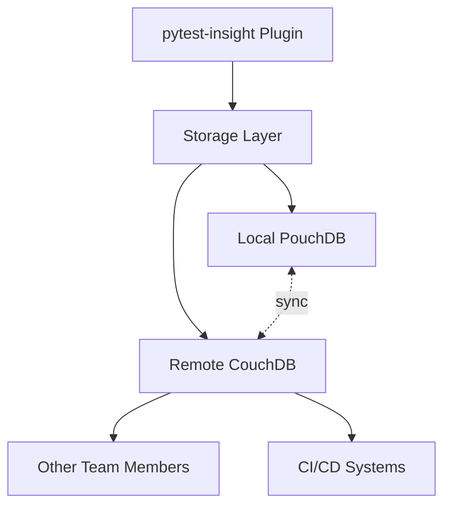

```mermaid
graph TD
    A[pytest-insight Plugin] --> B[Storage Layer]
    B --> C[Local PouchDB]
    B --> D[Remote CouchDB]
    C <-.sync.-> D
    D --> E[Other Team Members]
    D --> F[CI/CD Systems]
```
